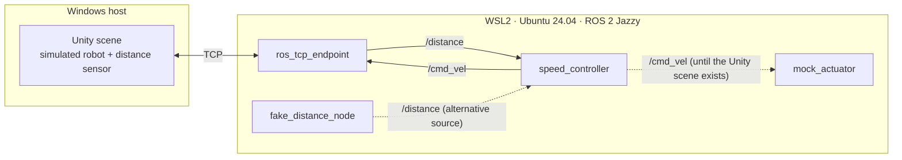

# ros2-unity-sim

A small distributed ROS 2 system that uses Unity as its simulation environment. A simulated distance sensor feeds a controller node that decides how fast a simulated robot may move, and the robot reacts in the Unity scene.

The scenario itself is deliberately simple. The point of the project is the communication between the parts: how messages travel between ROS 2 nodes, how they cross the boundary between ROS 2 and Unity, and what the system does when that communication degrades or stops.

## Status

**Design phase. There is no code in this repository yet.** This README describes the intended design and the decisions made so far. It will be updated as parts are actually built.

- [ ] Python nodes: fake distance source, speed controller, mock actuator
- [ ] Unity scene connected through the ROS–TCP bridge
- [ ] Defined behaviour when the distance source stops publishing
- [ ] One node ported to C++

## Use of AI

All code in this repository is written by me. I use AI tools only to review code and to discuss design decisions, never to generate code. This README was drafted with AI assistance.

## Planned architecture

- **Distance source** publishes readings on `/distance` (`sensor_msgs/Range`). There are two interchangeable sources behind the same topic and message type: a fake Python node that generates synthetic readings, and the Unity scene.
- **Speed controller** (Python, rclpy) subscribes to `/distance` and publishes an allowed velocity on `/cmd_vel` (`geometry_msgs/Twist`). Initial rule: full speed when the path is clear, slower as the obstacle gets closer, stop below a threshold.
- **Actuator** is the simulated robot in Unity. Until the scene exists, a mock node logs the commands instead.
- **ROS–TCP endpoint**: Unity does not speak DDS. It connects over TCP to an endpoint node on the ROS 2 side, which republishes messages into the ROS 2 graph.

## Decisions so far

| Decision | Alternative | Reason |
|---|---|---|
| ROS 2 Jazzy | Humble, newer releases | Current LTS with support until 2029 and mature tooling |
| Python (rclpy) first, one node in C++ later | Everything in C++ | Learn the ROS 2 concepts without fighting the language at the same time; use C++ where it makes a difference |
| Unity as simulator | Raspberry Pi with a real sensor | No hardware dependency, and scenarios can be repeated exactly |
| Swappable distance source | Unity only | Nodes can be developed and tested without Unity; real hardware could be added the same way |
| Standard message types | Custom messages | No separate interface package needed, and tools such as RViz can display the data without extra plugins |
| WSL2 | Native Linux (dual boot) | Unity runs on Windows; no real-time measurements are planned, so VM timing noise is acceptable |

## Non-goals

- No latency benchmarks or statistical performance analysis.
- No real hardware for now.
- No realistic physics or detailed Unity scene. The scene stays minimal.
- No navigation (Nav2), manipulation or ros2_control.
- Not a reusable library.

## Open questions

- Is the Unity ROS–TCP Connector still maintained and compatible with Jazzy and current Unity versions? The alternative is running ROS 2 natively inside Unity (for example Ros2ForUnity), which avoids the TCP hop but ties the build to platform-specific ROS 2 libraries.
- Which QoS guarantees survive the TCP bridge? The endpoint republishes messages with its own publishers, so QoS settings on the Unity side may not mean the same as between two ROS 2 nodes.
- How should the controller react when distance readings stop: QoS deadline and liveliness events, or a timer-based watchdog inside the node?
- Networking between Windows and WSL2: default NAT or mirrored networking mode?
- Which node is worth porting to C++, and by what criterion?
